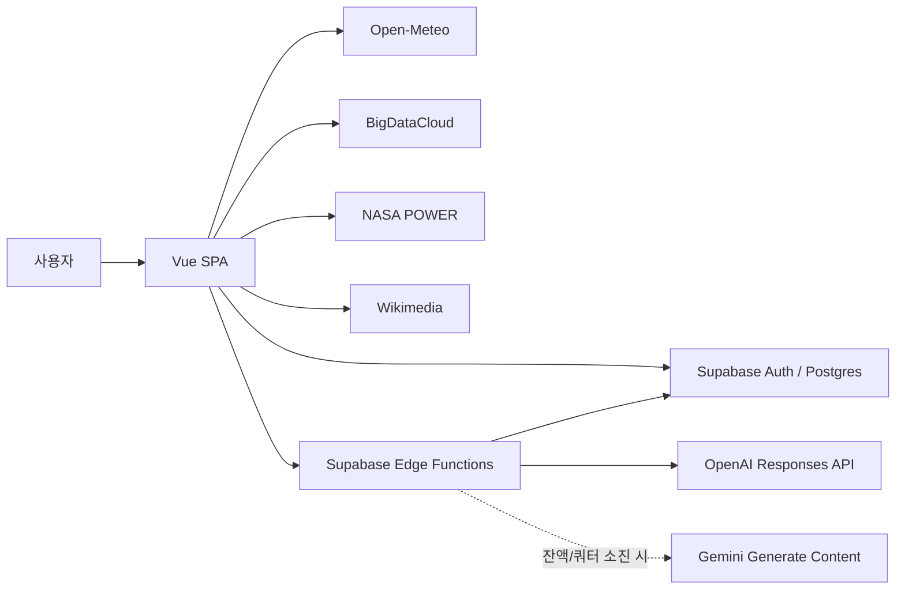

# Weather — 날씨 기반 여행 플래너

현재 위치와 세계 주요 도시의 날씨를 확인하고, 여행 날짜의 예보·대기질·주변 장소를 바탕으로 실제 일정을 준비하는 Vue 웹 서비스입니다. 좌표와 날씨 수치는 전용 데이터 API에서 가져오고, OpenAI 또는 설정된 Gemini 대체 공급자는 검증된 입력을 자연스러운 옷차림 조언과 여행 정보로 가공하는 역할만 담당합니다.

[서비스 바로가기](https://kngyeol.github.io/skala-vue/) · [배포 워크플로](https://github.com/kngyeol/skala-vue/actions/workflows/deploy-pages.yml)

## 핵심 사용자 흐름

1. 현재 위치를 허용하거나 세계 날씨 서랍에서 도시를 선택합니다.
2. 도시 상세 화면에서 현재 날씨, 3시간 간격 예보, 5일 예보, 준비 조언과 플레이리스트를 확인합니다.
3. 여행 화면에서 도시·날짜·속도·관심사를 고르면 예보, 대기질, 주변 장소와 AI 일정을 함께 구성합니다.
4. 로그인하면 생성한 일정을 저장하고 `내 여행`에서 다시 확인하거나 삭제할 수 있습니다.

## 주요 기능

- 현재 위치 및 48개 세계 주요 도시의 현재 날씨
- 지역·도시명 검색과 필터를 제공하는 세계 날씨 서랍
- 3시간 간격 단기 예보와 5일 도시 상세 예보
- 자유 입력 도시 지오코딩과 최대 16일 여행 예보·현재 대기질
- 예보 범위를 벗어난 날짜의 NASA POWER 2001–2020 과거 기후 참고
- Wikimedia 기반 주변 장소 후보와 원문 링크
- OpenAI 또는 Gemini 웹 검색을 활용하고, 검증된 경우 출처를 표시하는 최대 14일 여행 일정
- 현재 날씨 기반 AI 옷차림·준비물 추천
- 날씨 상태에 맞는 Spotify 플레이리스트 임베드
- Supabase 이메일 로그인, 사용자별 여행 저장, 선택형 Google OAuth

## 화면 경로

| 경로                 | 화면                            |
| -------------------- | ------------------------------- |
| `/#/`                | 현재 위치·세계 날씨             |
| `/#/weather/:cityId` | 도시 상세 날씨·준비 조언·음악   |
| `/#/travel`          | 여행지 검색·날짜 선택·일정 생성 |
| `/#/login`           | 이메일 로그인·회원가입          |
| `/#/trips`           | 로그인 사용자의 저장 일정       |

GitHub Pages의 하위 경로와 새로고침을 안정적으로 지원하기 위해 Hash History를 사용합니다.

## 기술 구성

| 영역           | 기술·서비스                    | 역할                                                    |
| -------------- | ------------------------------ | ------------------------------------------------------- |
| 프런트엔드     | Vue 3, Vite, Pinia             | 화면, 상태 관리, 지연 로딩                              |
| 라우팅         | Vue Router                     | 날씨·여행·인증 경로와 로그인 보호                       |
| 현재·예보 날씨 | Open-Meteo Forecast            | WMO 상태, 기온, 습도, 풍속, 일출·일몰, 시간별·일별 예보 |
| 현재 위치 이름 | BigDataCloud Reverse Geocoding | 좌표를 도시·국가명으로 보강                             |
| 도시·대기질    | Open-Meteo Geocoding/AQI       | 자유 입력 도시 좌표 확정, AQI·미세먼지·자외선           |
| 장기 날짜 참고 | NASA POWER                     | 예보가 아닌 2001–2020 월별 기후 참고                    |
| 주변 장소      | Wikimedia API                  | 좌표 주변 장소 후보, 설명, 원문 링크                    |
| 인증·저장      | Supabase Auth/Postgres         | 사용자 세션, 여행 일정, Row Level Security              |
| 서버리스 함수  | Supabase Edge Functions        | 사용자 JWT 검증, AI 호출, 캐시, 사용자별 요청 한도      |
| AI 가공        | OpenAI Responses API + Gemini  | 날씨 조언, 웹 검색 기반 여행 정보, 검증된 출처          |
| 음악           | Spotify Embed                  | 별도 Spotify OAuth 없는 플레이리스트 재생·외부 열기     |



## 로컬 실행

Node.js 20 계열은 20.19 이상, 또는 Node.js 22.12 이상이 필요합니다.

```sh
npm ci
npm run dev
```

기본 주소는 <http://localhost:3000>입니다. 현재 날씨, 도시 검색, 예보, 대기질, 기후 참고와 주변 장소 조회는 별도 개인 API 키 없이 실행할 수 있습니다.

로그인·저장·AI 기능까지 사용하려면 `.env.example`을 참고해 루트에 `.env.local`을 만들고 Supabase의 공개 클라이언트 값만 설정합니다.

```dotenv
VITE_SUPABASE_URL=https://your-project.supabase.co
VITE_SUPABASE_PUBLISHABLE_KEY=sb_publishable_replace_me
VITE_GOOGLE_AUTH_ENABLED=false
```

`VITE_GOOGLE_AUTH_ENABLED`는 Supabase에서 Google provider를 실제로 구성했을 때만 `true`로 바꿉니다. OpenAI·Gemini 키와 Supabase service-role key에는 `VITE_` 접두사를 붙이지 않으며 브라우저 환경 변수에 저장하지 않습니다. 데이터베이스와 Edge Function 설정은 [Supabase + AI 설정](docs/SUPABASE_SETUP.md)을 따릅니다.

## 데이터 신뢰성과 비용 제어

- 좌표, 날짜, 날씨, 대기질은 전용 API 응답을 사실 원본으로 사용하며 누락 수치를 임의로 만들지 않습니다.
- NASA POWER 값은 `과거 기후 참고 · 예보 아님`으로 분리해 특정 날짜의 예보처럼 표시하지 않습니다.
- AI 요청은 인증된 Edge Function에서만 수행하고 provider별 JSON Schema 출력을 사용합니다.
- 여행 웹 정보는 실제 AI provider 출처 목록과 교차 검증한 URL만 클릭 가능한 링크로 표시합니다.
- 여행 일정은 입력으로 전달한 장소 후보만 사용할 수 있도록 서버와 응답 검증 양쪽에서 제한합니다.
- AI 요청 한도는 사용자별로 날씨 조언 시간당 20회, 여행 일정 시간당 6회입니다.
- 동일한 날씨 조언은 30분, 여행 일정은 6시간 동안 서버 캐시를 재사용합니다.
- OpenAI 잔액/쿼터 소진 시 secondary OpenAI 키를 먼저 시도하고, 실패하면 설정된 Gemini 키로 한 번 전환합니다.
- 홈은 선택 도시만 먼저 조회하고, 48개 세계 날씨는 서랍을 열 때 지연 로딩합니다. 성공한 응답은 브라우저에서 30분간 재사용합니다.
- 외부 API 한도나 장애는 원문 오류 대신 사용자가 대응할 수 있는 안내로 변환하며 임의의 대체 날씨를 만들지 않습니다.

## 인증과 보안

- 브라우저에는 Supabase URL과 publishable key만 전달합니다.
- Edge Function은 전달받은 사용자 JWT를 서버에서 다시 검증합니다.
- `trips`는 RLS로 로그인 사용자의 행만 읽고 변경할 수 있습니다.
- AI 캐시와 요청 한도 테이블은 브라우저 역할에서 직접 읽거나 수정할 수 없습니다.
- 브라우저 요청은 명시한 Origin allowlist로 제한합니다.
- Google 로그인이 비활성인 배포에서는 동작하지 않는 Google 버튼을 노출하지 않습니다.

## 검증

```sh
npm run check
```

위 명령은 Node 테스트, Oxlint, ESLint, 프로덕션 빌드를 순서대로 실행합니다. Edge Function은 별도로 다음과 같이 확인합니다.

Edge Function 정적 검증에는 Deno 2가 별도로 필요합니다.

```sh
deno fmt --check supabase/functions
deno check supabase/functions/weather-advice/index.ts
deno check supabase/functions/generate-itinerary/index.ts
```

빌드 통과와 브라우저 검증은 구분합니다. 배포 전에는 데스크톱·모바일에서 날씨, 여행, 로그인, 로딩, 빈 상태와 오류 상태를 직접 확인합니다.

## GitHub Pages 배포

`.github/workflows/deploy-pages.yml`은 `main` 푸시 시 검증과 빌드를 실행한 뒤 GitHub Pages에 배포합니다.

1. `Settings > Pages`에서 Source를 `GitHub Actions`로 선택합니다.
2. `Settings > Secrets and variables > Actions > Variables`에 `VITE_SUPABASE_URL`, `VITE_SUPABASE_PUBLISHABLE_KEY`를 등록합니다.
3. Google provider를 구성한 경우에만 `VITE_GOOGLE_AUTH_ENABLED=true`를 추가합니다.
4. `main`에 푸시하거나 `Deploy GitHub Pages` 워크플로를 수동 실행합니다.

필수 Supabase 변수가 비어 있으면 워크플로가 배포 전에 실패합니다. 두 Vite 값은 공개 클라이언트 설정이므로 최종 번들에서도 확인할 수 있으며, 실제 데이터 보호는 RLS와 서버 측 JWT 검증이 담당합니다.

## 문서

- [Supabase + OpenAI 배포 설정](docs/SUPABASE_SETUP.md)
- [자연스러운 서비스 UI 플레이북](docs/FRONTEND_DESIGN_PLAYBOOK.md)
- [배경 영상 출처와 라이선스](docs/MEDIA_SOURCES.md)
